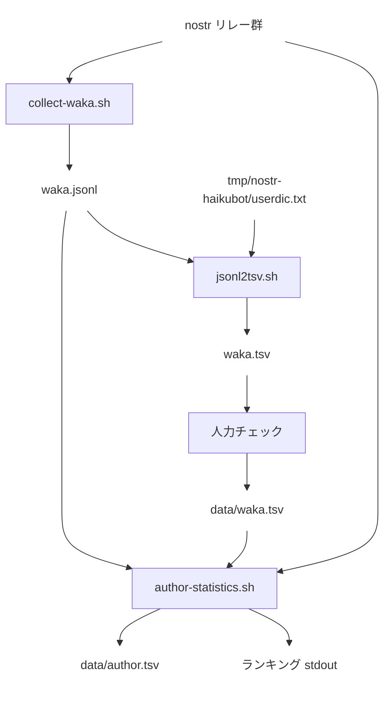

# ツール

`tools/` 配下のスクリプトとデータの関係。

## スクリプト

| スクリプト | 役割 |
|---|---|
| `collect-waka/collect-waka.sh` | `@haiku` ボットの kind:10002 が指す全リレーから `#n57577` を含む kind:1 を since/until ページングで全件取得し `waka.jsonl` に保存 |
| `collect-waka/jsonl2tsv.sh` | `waka.jsonl` を読み、`@haiku` と同じ kagome (ipa-neologd) + `userdic.txt` で 5-7-5-7-7 に分割し読み (平仮名) と note1 を付けて `waka.tsv` (12 列) を出力 (内部で `blocksplit/` の Go バイナリを呼ぶ) |
| `collect-waka/author-statistics.sh` | `waka.jsonl` から元和歌の author を集計してランキングを stdout に出力。さらに `data/waka.tsv` (flag=1) に対応する author の kind:0 を取得し `data/author.tsv` (npub1, name, display_name, picture) を出力 |

## 人力チェック

`waka.tsv` の 1 列目フラグを `1` (採用) / `0` (不採用) に編集し、`data/waka.tsv` として保存する。

## クレジット

- 5-7-5-7-7 判定および形態素解析ロジックは [`mattn/go-haiku`](https://github.com/mattn/go-haiku) (上流 README で MIT 宣言、著者: Yasuhiro Matsumoto) に由来します。`tools/collect-waka/blocksplit/main.go` のうち補助関数・正規表現群は同ライブラリから複製、`splitTanka` のループは `MatchWithOpt` を派生・改変したものです。[`LICENSES/go-haiku.MIT`](../LICENSES/go-haiku.MIT) を参照。
- 辞書 `kagome-dict-ipa-neologd` は Go モジュール依存として haikubot と同じものを利用 (各々のライセンスは依存パッケージに従う)。
